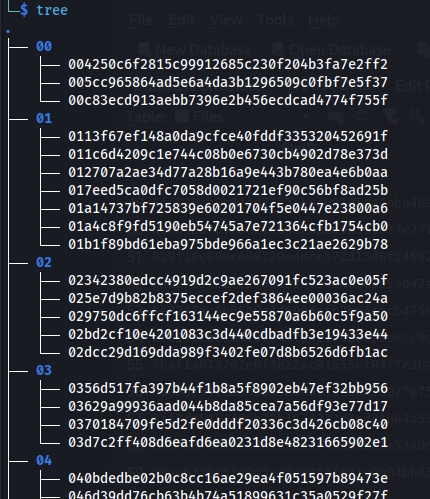
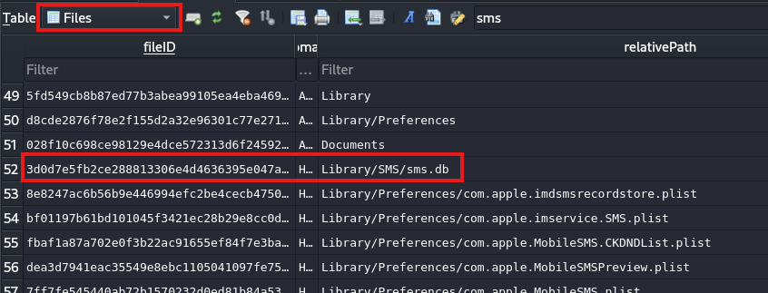
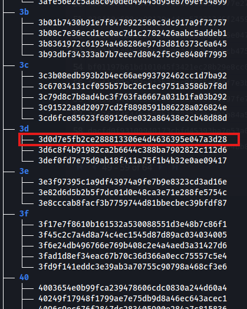

# ios_backup_hash2path
Converting hashed-name backup files of iOS to their normal name (and restoring the folder structure)

## Requirements
Non :) Just have python
Only use standard library :)

## Why ?
Here is a screen of a iOS backup:


Like you can see it's not obvious what each file is :/
But ! We can recover the original filename and also the path of the file with the **Manifest.db** file!

Let's take an example, on the following screenshot I've opened the **Manifest.db** file, and searched for the sms.db file:


In this DB we have the hash value of the file, and if I look at my files, I have:


Very nice! But nobody wants to do this with every file all day long!

This is why I made this little script :D

## Usage
```bash
usage: main.py [-h] -i BACKUP_DIR -m MANIFEST_DB [-o OUTPUT_DIR] [-v]

Restore iOS hashed-name backup files to their original name.

options:
  -h, --help            show this help message and exit
  -i BACKUP_DIR, --backup-dir BACKUP_DIR
                        Path to the backup directory containing hash-named subfolders.
  -m MANIFEST_DB, --manifest-db MANIFEST_DB
                        Path to the Manifest.db file.
  -o OUTPUT_DIR, --output-dir OUTPUT_DIR
                        Output directory for restored files (default: ./result).
  -v, --verbose         Enable verbose output (show missing file warnings)
```

This script is so simple to use that even my grandma could use it! Just give the directory containing the hash named file, the **Manifest.db** file and the output dir if you want!

Example:
```bash
$ python script.py --backup-dir ./backup --manifest-db ./backup/Manifest.db

# result
$ ls result 
BDSICloudIdentityToken.plist                      keychain-backup.plist
Breakpad                                          Library
com.apple.MobileSMS                               linkd.metadatastore.sqlite3
com.apple.networkextension.control.plist          locationd
com.apple.networkextension.plist                  Maps
com.apple.notes.databaseopen.lock                 Media
com.apple.wifi.known-networks.plist               mobile
com.apple.xpc.launchd                             NoteStore.sqlite
config.plist                                      past-sessions.json
CRDTModelFileSync                                 PlugInKit-Annotations
Documents                                         ProvisioningProfiles
fba_extentions_event_store                        ReinstallDetection
Health                                            SystemConfiguration
IABPCMAdConversionsStorage.IABPCMControllerCache  trustd
```

## HAVE FUN :D